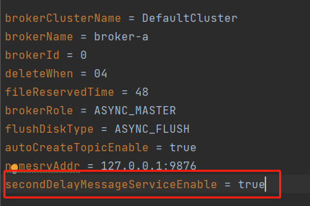
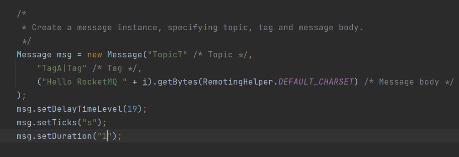

## Second Level Delay Wheel Timer
**rocketmq 秒级精确延时时间轮 实现了任意 【s】、【m】、【h】、【d】延时时间消息
，相比于开源rocketmq只有18个固定等级的时间延时更加灵活，可以满足更多的任务场景。**

实现原理是通过增加一个等级为19的延时，然后将所有延时等级为19的消息都加入到一个HashedWheelTimer
中，等待发送。

使用方法如下：

首先配置broker.conf

需要开启secondDelayMessageServiceEnable=true；（目前代码中默认值是true
，即不开启也可以直接使用精确延时。值为false，则默认使用开源rocketmq延时等级18）

第二步配置消息延时

msg.setDelayTimeLevel(19); //设定延时等级为19 （否则不能使用） 

msg.setTicks("s"); //设定时间轮刻度值 （若是“s”，则表面当前是1s为一跳）.

msg.setDuration("1"); //设定消息延时的度量值 （即延时一个单位）

总的延时时间为 duration * ticks = 1s

